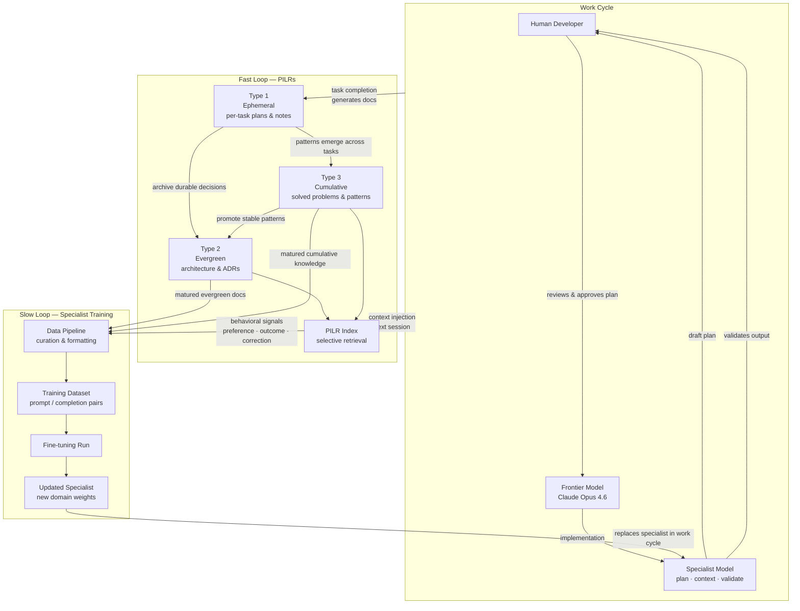
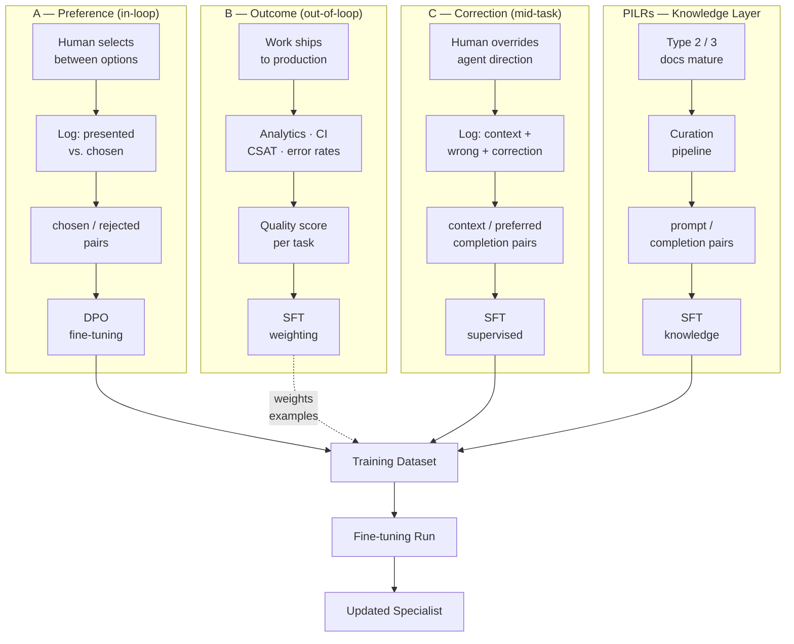
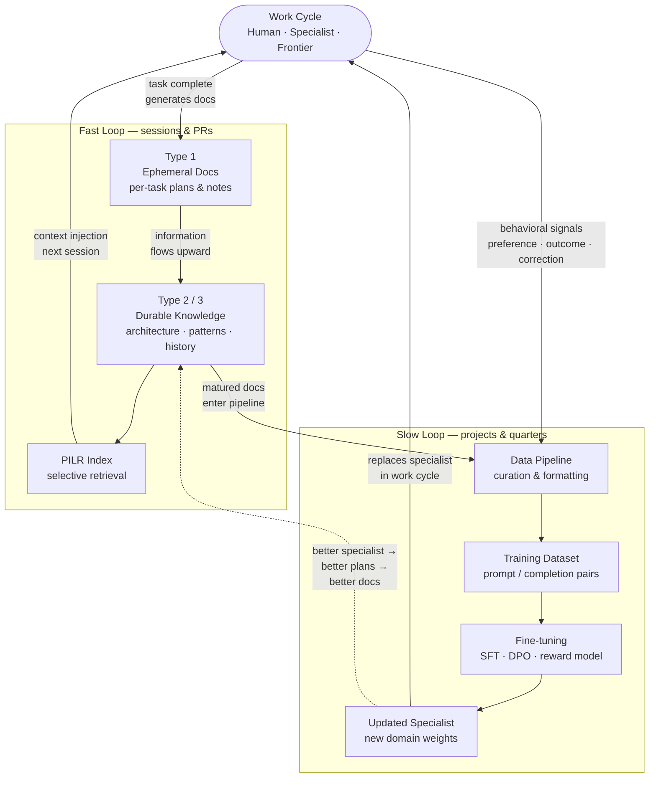

*This post is part of a series on agentic context engineering. It builds on the [PILRs post](/blog/context-engineering-pilrs/) — if you haven't read that one, the fast loop section will make more sense if you do. The fast loop is something I've built and tested at RIVET. The slow loop is where the architecture leads for teams with ML infrastructure — I'm presenting the design, not a field report.*

---

Most teams optimizing their agents are working on the current session. Better prompts. Better CLAUDE.md files. Better context management. All of that is worth doing, and all of it improves *this* run.

None of it compounds.

Here's the problem: you wouldn't evaluate a new engineer by their first week. You'd evaluate them by how they develop over months of working on your product — by whether their understanding deepens, whether they start anticipating problems, whether they eventually become someone who can lead. The career arc is the point. Agents have no career arc — unless you build one.

The analogy holds, but the timelines are completely different — and in FLOW's favor. A new engineer takes weeks to be impactful and months to stop needing guidance on your domain; senior hires on complex codebases may still be ramping at a year. A well-instrumented FLOW system shows measurable improvement after days of operation. The fast loop compounds session over session — every PR, every task leaves the agent better equipped for the next one. The slow loop adds a different kind of progress: a fine-tuning run produces a step change in capability, not a gradual slope. The agent doesn't take months to become useful. It starts useful and keeps getting better.

There's a second difference the human analogy doesn't capture: a human developer's growth is their own. When someone learns your auth system deeply, that knowledge lives in one person's head. When FLOW's fast loop captures what the agent learned about your auth system, every team member benefits from it on their next session — immediately. Every improvement is shared across whoever uses the system. A fine-tuning run improves the specialist for the entire team simultaneously. The more people using the system, the more behavioral signal it generates, and the faster the slow loop improves. FLOW compounds with usage in a way individual human development never can.

FLOW is the architecture for building it.

---

## FLOW: Fast/slow Learning Over Work

FLOW is a two-loop system for continuously improving agents through the work they do. Each word in the name does real work: **Fast/slow** names both loops. **Learning** names the mechanism — not retrieval, but genuine improvement. **Over Work** names the source — the system improves through the work itself, not through a separate effort.

**The fast loop** captures knowledge externally. As the agent works, what it learns gets documented and indexed in a way that makes every subsequent session more capable. This loop operates at the speed of tasks and PRs. It's already well-understood enough to have a name: [PILRs](/blog/context-engineering-pilrs/).

**The slow loop** encodes that knowledge permanently. It trains a domain-specific specialist model on two signal sources: the structured knowledge PILRs accumulate, and the behavioral signals the running system generates — what humans chose, what telemetry revealed about outcomes, where the agent was corrected. This loop operates at the speed of projects and quarters. The specialist doesn't need to be *told* about your patterns; it *knows* them — and it's calibrated to how your team actually works.

The two loops are not independent. The fast loop feeds the slow loop: knowledge captured externally becomes knowledge encoded in weights, and behavioral signals generated through real work become training data. The slow loop feeds the fast loop: a better-trained specialist makes better decisions, generates better plans, and produces better PILRs. Each cycle leaves the system more capable than the last.

---

## System Architecture

The diagram below maps the full system — the work cycle where human, specialist, and frontier model collaborate; the fast loop where knowledge accumulates session-to-session through PILRs; and the slow loop where that knowledge, alongside behavioral signals from real work, trains an improving specialist. All three are connected, and the arrows between them are the point.

---

**A single feature through the system.** Imagine your team is adding Stripe webhook processing — the kind of feature that looks simple on the surface and has a dozen subtle correctness requirements underneath.

The work cycle opens with the specialist. It drafts a plan drawing on the Type 2 PILR that documents your event processing architecture, the Type 3 entry that captured how you solved idempotency in a previous billing integration, and the ADR that established your error handling conventions for external API calls. The plan it produces isn't generic webhook advice — it's shaped by how your system actually works. The human reviews it and approves with one change: scope down the retry logic to match a recent architectural decision the specialist hadn't encountered before.

That scope change is a signal. It gets logged as a correction event — the specialist's direction versus what the human chose. It becomes Category C training data. The task also generates a Type 1 PILR: the implementation plan, the scope note, the final approach. The frontier model implements the feature. When it ships cleanly and Sentry shows zero post-deploy errors, that outcome gets attached to the task as Category B signal.

Three months later, the slow loop runs. The Type 1 doc has migrated into a Type 3 entry on webhook patterns. The scope correction is in the preference dataset alongside a hundred other human choices. The fine-tuning run encodes both — the pattern and the calibration. The next time the team builds a payment feature, the specialist's first plan already reflects the corrected scope boundary. The correction doesn't happen again.

That's one cycle. The system compounds this across every feature.

---

## The Fast Loop: PILRs

The [PILRs post](/blog/context-engineering-pilrs/) covers the implementation in depth. Here's what matters for understanding its role in FLOW.

PILRs — Persistent Indexed Learning Repositories — are structured knowledge bases the agent can reference on demand. Three types, each with a distinct lifecycle:

**Type 1 (ephemeral):** Per-task planning docs, test plans, implementation notes. Created before a feature starts, discarded or archived when it ships. High signal during implementation; noise afterward. These give the agent task-specific context at the moment it matters most.

**Type 2 (evergreen):** System architecture docs, API contracts, architectural decision records. Created when decisions are made, updated when systems change, never deleted without replacement. These give the agent durable system knowledge — the kind that makes every new feature start from an informed position rather than a cold start.

**Type 3 (cumulative):** Solved problems, incident post-mortems, bug patterns, product evolution history. Always growing. These give the agent institutional memory — the ability to recognize "we've seen this class of problem before" rather than reasoning from scratch each time.

The fast loop operates through two mechanisms. First, **context injection**: the PILR index surfaces relevant documents for each task, loading what the agent needs without flooding the context window with everything it might need. Second, **information flows upward**: decisions captured in Type 1 docs that prove durable get archived into Type 2; patterns that emerge across multiple Type 3 entries get promoted into Type 2 as well. Each cycle, the agent's baseline starting point improves.

This is the loop most engineering teams can build today. It requires no ML infrastructure — only discipline about documentation, indexing, and the "information flows upward" review process. The [context rot research from Chroma](https://www.trychroma.com/research/context-rot) documents why the indexing matters so much: performance degrades non-linearly as context grows, and how information is presented matters as much as whether it's present at all. PILRs are the answer to both problems.

PILRs are also the raw material for the slow loop. Every piece of curated, durable knowledge in your Type 2/3 docs represents a signal the slow loop needs: what does this system do, how does it work, what patterns does this team follow, what problems have already been solved. The fast loop generates and curates that signal. The slow loop encodes it permanently.

---

## The Slow Loop: Specialist Model Training

This is the part of FLOW that requires ML infrastructure. The fast loop is buildable by any engineering team today. The slow loop requires the capacity to manage training pipelines, curate training data, evaluate model performance over time, and operate the infrastructure that fine-tuning demands. This is the domain of teams with dedicated data science and ML capability — AI-native companies, research-oriented engineering organizations, or teams with the resource to build this infrastructure deliberately.

I'm presenting the architecture and the key design decisions. This is not a field report.

### Fine-tuning vs. RAG: understanding the distinction

Before going deeper on the slow loop, it's worth being precise about what fine-tuning achieves that retrieval-augmented generation (RAG) — the mechanism behind PILRs — doesn't.

RAG injects knowledge into context at runtime. The model receives relevant documents, processes them alongside the task, and produces output informed by what it was given. It's powerful, fast to set up, and what the fast loop is built on. Its ceiling is the context window: how much can be injected, how well the model processes it, and how accurately the retrieval surfaces the right documents.

Fine-tuning encodes knowledge into weights. The model doesn't need to be told about your patterns — they're part of how it reasons. This has several implications. Token costs drop because you're not loading context that the model already has internalized. Latency improves for the same reason. And crucially, the quality of the work changes: a model reasoning from internalized domain knowledge operates differently than a model processing retrieved text. It can generalize from that knowledge, apply it to novel situations, and catch deviations from it — not because it was handed a document, but because the patterns are embedded in how it thinks.

Research on domain-specific fine-tuning consistently shows that smaller fine-tuned models outperform larger general models on tasks within their training domain. The specialist doesn't need the frontier model's breadth — it needs your domain's depth. That's a very achievable target for fine-tuning.

The relationship between RAG and fine-tuning in FLOW isn't either/or — it's sequential. The fast loop (RAG via PILRs) operates first, immediately, and continuously. The slow loop (fine-tuning) follows, operating on the matured output of the fast loop. RAG generates the training signal; fine-tuning encodes it.

### What the specialist model is

A specialist model is a domain-fine-tuned model trained on two complementary signal sources: the structured knowledge your PILRs accumulate, and the behavioral signals generated by the agent's actual outcomes — what humans chose, what the world told you about the work, and where the agent went wrong.

The PILR layer provides ground truth: your system's architecture, the patterns your team follows, the classes of problems you've solved before. The behavioral layer provides calibration: which plans humans actually approved, which implementations held up in production, which outputs required correction. For a coding agent, that behavioral layer includes human plan selections, PR approval patterns, CI and error rate telemetry, and downstream product analytics — amplitude events, user retention signals, whatever instrumentation your product runs. A specialist trained on both layers knows your domain *and* knows how to perform in it.

Where a frontier model like Claude Opus 4.6 brings broad reasoning capability across all domains, the specialist brings depth on your specific product. It doesn't need the frontier model's breadth — it needs your domain's depth, calibrated to how your team actually works and what your users actually do.

The specialist is not meant to replace the frontier model. It's meant to handle the work that doesn't require frontier-model reasoning: planning, scoping, validation, and domain context provision. Delegating these roles to the specialist means the frontier model spends its cycles on the work that actually demands it — complex architectural decisions, novel multi-system changes, problems the specialist hasn't learned yet.

**One model is the right starting point.** All three roles share the same underlying requirement: deep knowledge of your domain. A single fine-tuned model can cover all three through different prompts. The architecture grows from there — not according to a plan, but in response to specific problems you observe.

### The specialist's three roles

**Planning and prototyping.** Before the frontier model is invoked, the specialist drafts plans and lightweight prototypes for human review. This is the most significant token efficiency gain in the system. The specialist can explore the solution space — generating multiple approaches, identifying constraints, scoping the work — at a fraction of the frontier model's cost. The frontier model runs once a direction is approved, not to figure out what to build, but to build it well.

This also changes the nature of the human checkpoint. A human reviewing a specialist's plan is reviewing domain-aware reasoning from a model that knows the codebase, not a generic decomposition from a model reasoning from first principles. The plans are better, the reviews are faster, and the frontier model invocations are more targeted.

**Domain context provision.** The specialist's trained knowledge reduces how much context the frontier model needs injected to do its job. What previously required loading a full architecture document — a Type 2 PILR explaining your auth system — becomes implicit in the specialist's weights. The frontier model can work with a leaner context, which reduces cost and improves the signal-to-noise ratio in every invocation. The specialist doesn't replace the frontier model's reasoning; it reduces the setup cost for each use.

**Validation.** The specialist reviews frontier model outputs against your established patterns and conventions. Not a generic linter — a model that knows your codebase's idioms, your team's architectural constraints, your standards for error handling and API design. The closer the specialist's domain knowledge gets to your codebase, the more precisely it can flag deviations. Over time, this validation layer gets better at exactly the things that matter for your system.

### The specialization progression

The three roles are distinct tasks, but they don't require distinct models from the start. The right architecture at each stage is determined by the problem you're actually trying to solve.

---

**Step 1: A single fine-tuned autoregressive LLM**

*The problem it solves: the agent starts cold on every session; planning is generic; validation is absent.*

Start with a decoder-only transformer — a Haiku-class model, Llama 3.1 8B, Mistral 7B, or comparable. Fine-tune it on your PILR data using supervised fine-tuning (SFT): instruction-following format, domain context in the system prompt, the task or output to evaluate in the user message, and the correct plan or critique as the completion.

All three roles run on the same model weights, differentiated by the system prompt:

- **Planning prompt:** *"You are a software architect for [product]. Given this spec and the architectural context below, produce an implementation plan that follows our established patterns..."*
- **Validation prompt:** *"You are a code reviewer for [product]. Given the established patterns below, identify any deviations in the following implementation..."*
- **Domain context:** implicit — the model's weights carry the architectural knowledge, reducing how much context the frontier model needs injected per session.

The training data format for planning examples is a direct translation of your Type 1 docs: the spec is the prompt, the implementation plan is the completion. For validation examples, Type 3 docs (solved problems, bug patterns) become labeled examples: the problem description plus the correct approach is a positive example; variations with known-wrong approaches are negatives.

This step doesn't require anything exotic. SFT on instruction-following data is the most well-understood fine-tuning technique available. The hard part is the data curation, not the training.

**Signal to move to Step 2:** your PILR corpus has grown to hundreds of documents; planning quality has plateaued even as training data has grown; the right architectural context isn't reliably surfacing for each task. The model knows the domain but retrieval isn't giving it the right context window to work from.

---

**Step 2: Add a fine-tuned embedding model**

*The problem it solves: as the PILR corpus scales, general-purpose embeddings lose precision on your domain's vocabulary.*

A standard embedding model doesn't know what "service boundary" means in your product's architecture, or that "auth" in your codebase refers to a specific multi-tenant middleware pattern, not OAuth in general. Off-the-shelf semantic search works on your domain's language only as well as the embedding model understands it. At low document counts, this is a rounding error. At hundreds of Type 2/3 docs, it becomes the retrieval quality ceiling.

The fix is an encoder-only transformer — a BERT/RoBERTa-class model, or a sentence-transformer variant — fine-tuned on your retrieval patterns using contrastive learning. The training signal comes from your PILR usage history: which documents were actually loaded and used for past tasks. Positive pairs are (task description, docs retrieved and used). Negative pairs are (task description, docs that exist but weren't relevant). The model learns to pull your codebase's vocabulary into the embedding space in a way that reflects actual retrieval relevance, not just surface semantics.

This model runs at retrieval time, completely separate from the generative specialist. It improves the domain context provision role directly — the right context surfaces for each task — and improves planning quality as a side effect, since the generative specialist is now working from more relevant inputs.

One architectural refinement worth knowing: a **bi-encoder** (what most embedding pipelines use) embeds query and document independently, enabling fast approximate-nearest-neighbor search over large corpora. A **cross-encoder** re-scores candidate pairs jointly, with significantly higher precision but much higher latency. The practical pattern is to use a bi-encoder for first-pass retrieval (top-50 candidates) and a cross-encoder for re-ranking (narrowing to top-5). The cross-encoder requires more compute but can be fine-tuned on smaller labeled datasets since it sees both query and document together.

**Signal to move to Step 3:** planning is working well; retrieval is surfacing relevant context; but validation recall is low — the specialist is missing pattern deviations that later get caught in code review or production. The generative model is being agreeable when it should be critical.

---

**Step 3: Add a reward model for validation**

*The problem it solves: generative models prompted to validate have a systematic sycophancy bias — they miss violations.*

This is a known failure mode of LLM-as-judge: models trained to produce helpful, agreeable responses have a built-in bias toward false negatives when asked to evaluate outputs. When you prompt the specialist *"does this implementation follow our established patterns?"*, its training pushes it toward yes. It will catch obvious violations. It will miss subtle ones — the error handling pattern that's almost right, the service boundary that technically works but violates the convention, the abstraction that's two layers too high.

A reward model has a different optimization target. It's not trained to produce plausible next tokens — it's trained specifically to discriminate between good and bad outputs. That distinction in optimization target is the point.

There are two practical approaches, depending on what training data you have:

**Classification head (labeled data).** Take the specialist's base model, replace the language modeling head with a linear classifier, and train it on labeled examples: frontier model outputs that correctly follow your patterns (positive), and outputs with known violations (negative). The violations should come from real failures you've observed — wrong error handling pattern, wrong service boundary, wrong abstraction layer — not synthetic edge cases. A production codebase has a finite vocabulary of things that go wrong; labeling real examples from your history gives you a training set that matches the actual distribution.

**Direct Preference Optimization — DPO (preference data).** If you have pairs of outputs where one is better than the other, DPO trains the model on the preference signal directly without a separate reward model head. You provide (chosen, rejected) pairs — "this implementation is preferred over this one" — and the model learns the gradient that makes chosen outputs more probable. DPO is lower-friction than RLHF (no separate reward model training step, no PPO) and performs competitively. If your review process already produces relative rankings ("this plan is better than that plan"), DPO is the natural training mechanism.

The reward model runs as a scoring gate. Two integration points matter:

- **In the agent loop:** frontier model generates an implementation → reward model scores it → proceed if above threshold, retry or route to human if below. The threshold is a tunable precision/recall tradeoff: higher threshold = fewer false positives, more false negatives; lower threshold = more flags, fewer misses.
- **In CI/CD:** PR changes → reward model scores against established patterns → automatic flag for human review if below threshold. This moves validation from a point-in-time agent loop step to a continuous property of the development pipeline. The reward model becomes a standing quality gate, not just a per-session check.

A secondary use: when the specialist is exploring multiple plans in Step 1, the reward model can rank them. Generate five plans, score all five, surface the top two to the human. The human reviews domain-aware candidates pre-filtered for pattern compliance — faster review, less noise.

---

**The full picture.** Step 1 is the specialist you build. Steps 2 and 3 are specialists you earn — by observing where Step 1 breaks down and targeting the specific failure. Not every FLOW implementation reaches Step 3. Many may not need Step 2. The progression is not a roadmap; it's a set of tools organized by the problem each one solves.

### How PILRs become training data

The "information flows upward" process in the PILRs framework — where decisions from ephemeral Type 1 docs get archived into evergreen Type 2, and patterns from Type 3 get promoted to Type 2 — is also the curation process for the slow loop's training data.

Each document type contributes a different kind of training signal:

**Type 1 docs** provide task-scoped examples: here's the problem, here's the plan, here's the implementation, here's the outcome. At scale, these become a dataset of planning and decomposition examples — what good plans look like for this codebase, what approaches work for this class of problem, what the right level of scoping looks like.

**Type 2 docs** provide architectural ground truth. These are the stable facts about how your system is designed and why: the data model, the service boundaries, the API conventions, the architectural decisions and the reasoning behind them. For a specialist model, this is the foundation — the knowledge that needs to be internalized to reason reliably about your domain.

**Type 3 docs** provide pattern recognition training. Here's how this class of problem presents. Here's how we've solved it. Here's what we tried that didn't work. This is the institutional memory layer — the knowledge that allows the specialist to recognize familiar patterns rather than treating every problem as novel.

The quality advantage here is significant. PILR data is inherently curated — it's been written by engineers who understood the problem, reviewed through normal development processes, and promoted to Type 2/3 only because it proved durable. This is a fundamentally different signal quality than fine-tuning on raw model outputs or synthetic data. The information flows upward process is doing double duty: it improves the fast loop by elevating the quality of knowledge available via context injection, and it curates the training signal the slow loop depends on.

### Beyond PILRs: behavioral training signals

PILRs are the knowledge layer — what the system knows about your domain. But a running FLOW system generates a second category of training signal: behavioral data. How the agent performs, what humans choose, what the world tells you about the outcomes. These signals train the specialist on *how* to work, not just *what* to know.

Three categories, each structurally different:

---

**Category A: Preference data (in-loop)**

Every human choice point in the work cycle is a preference pair. The specialist presents options — a plan, a set of approaches, a draft response — and the human picks one. That choice is (chosen, rejected) training data directly usable for DPO fine-tuning, no additional labeling required.

The signal accumulates in forms you may not think to collect:
- Human selects plan A from three options → A is preferred, B and C are rejected
- Human approves agent output without edits → strong positive signal
- Human rewrites the output before accepting it → edit distance is the rejection signal; the rewrite *is* the preferred completion
- Human accepts a plan but changes the scope → partial rejection; the delta identifies the gap

This is the recommendation engine framing. The specialist is making recommendations; the human operator is the implicit ranker. Every interaction generates a training pair. The collection requirement is modest: log what was presented and what was chosen.

---

**Category B: Outcome data (out-of-loop)**

Downstream systems tell you whether the agent's work actually held up in the world. This is delayed, harder to attribute, and the highest-quality signal in the system.

For a **software development agent**:
- Product analytics (Amplitude, Mixpanel) → feature engagement and retention indicate whether implementations served users as intended
- Error monitoring (Sentry, Datadog) → error rates after deploy are a direct signal on implementation quality; high error rate = the agent introduced defects
- CI/CD metrics → time-to-pass on the first PR submission is a proxy for plan quality; long review cycles mean more back-and-forth = the initial output was off
- Hotfix rate → features that required urgent patches within days of deploy are strong negative signals with real cost attached
- Support tickets by feature → user-reported confusion after a deploy indicates the implementation created unexpected behavior

For a **customer support agent**:
- CSAT scores after resolution → did the resolution actually satisfy the customer?
- Re-open rate → tickets marked resolved that the customer reopened; false positive resolutions
- Time-to-resolution → proxy for answer quality; fast resolution without re-open is a strong positive signal
- Deflection success → did the customer self-resolve with the agent's guidance, or did they require a human?

The challenge with outcome data is attribution. Low feature engagement could be the agent's implementation, or the product idea, or the marketing, or the onboarding. The training signal needs to stay close to decisions the agent actually controlled. Treat outcome data as a *weighting* signal rather than a hard label: a feature with zero post-deploy bug reports and fast PR merge is strong evidence of good implementation; a feature with a hotfix the next day is strong evidence of something the specialist should learn from. Use it to weight the preference data from category A, not to construct training pairs on its own.

---

**Category C: Correction data (mid-task)**

When a human intervenes during execution to redirect the agent, the correction event itself is a labeled training pair: the context, the agent's direction, and the human's correction. No reconstruction needed — the event is the example.

This is the most undervalued signal in the system. Engineers treat mid-task corrections as failures. They are, from a product perspective. From a training perspective, they're the highest-fidelity signal available — a domain expert demonstrating exactly what the agent should have done differently, in the exact context where the agent went wrong.

Correction data arises naturally in any agentic system where humans review agent work:
- Engineer redirects the specialist's plan mid-session → the redirect is the correction
- Support manager takes over a ticket and writes a different response → that response is the preferred completion for that ticket's context
- Sales rep rewrites an AI-drafted email before sending → the edit is the correction signal

The collection requirement is the same as category A: log the context, the agent output, and the human intervention.

---

**The full training signal picture**

PILRs and behavioral signals are complementary, not competing. PILRs encode *what the system knows* — architecture, patterns, decisions that have been validated over time. Behavioral signals encode *how the system should perform* — which outputs humans prefer, which implementations hold up in the world, where the agent goes wrong. A specialist fine-tuned on both learns both the domain and the job.

Put simply: PILRs teach the specialist what to know; behavioral signals teach it how to behave. The practical implication for data pipeline design: PILRs feed the knowledge fine-tuning pass (SFT on architecture and pattern documents); behavioral signals feed the alignment fine-tuning pass (DPO on preference pairs, correction data as supervised examples). Two fine-tuning passes with different data shapes and different optimization targets, producing a specialist that is both domain-knowledgeable and calibrated to how the humans on your team actually work.

---

**Signal availability by agent type**

Every domain where a human works alongside an agent generates all three signal types. The instrumentation just looks different:

| Domain | Preference signal | Outcome signal | Correction signal |
|---|---|---|---|
| Software development | Plan selection, PR approvals | Error rates, analytics, hotfix rate | Mid-session redirects, code review rewrites |
| Customer support | Response selection, escalation choices | CSAT, re-open rate, deflection success | Human agent takeover content |
| Sales | Email/proposal edits before send | Reply rate, deal close/lost | Rep rewrites, CRM notes on what worked |
| Legal / contract review | Which flagged clauses were acted on | Contract disputes from undetected issues | Lawyer redlines and rewrites |
| Personal assistant | Schedule/plan selections | Meeting completion, task follow-through | Human overrides and substitutions |

The question is whether you're collecting them.

### Evaluation: how do you know the specialist is improving?

A fine-tuning pipeline without evaluation is not a slow loop — it's a slow fire. Measuring whether the specialist is actually getting better at your domain is as important as the training itself.

A useful eval set for a coding specialist might include:
- **Planning quality:** given a spec, does the specialist's plan match the approach a senior engineer on the team would take? Does it correctly identify the affected systems? Does it scope the work accurately?
- **Domain accuracy:** does the specialist correctly identify which patterns apply to a given problem? Does it flag deviations from the team's conventions?
- **Validation precision:** on a set of frontier model outputs — some correct, some with deliberate pattern deviations — what's the specialist's precision and recall?
- **Preference alignment:** given two architecturally valid approaches, does the specialist surface the one this team has historically chosen? This tests whether the DPO training signal is calibrating the specialist to your team's actual working style, not just to correct patterns in the abstract.

The eval set should be built from real work on your codebase, not synthetic examples. And it should grow over time: as the codebase evolves, the eval set should evolve with it.

### Open design decisions

The FLOW architecture is independent of the choices below. These are separable decisions that depend on your stack, team, and infrastructure capacity.

**Training infrastructure**

The data that feeds FLOW's slow loop — PILR documents, behavioral signals, correction pairs — is proprietary. It contains your codebase architecture, your team's implementation patterns, your internal decision history. That data should not leave your infrastructure. Self-hosted open weights is the natural home for FLOW's slow loop, and the open source ecosystem has matured to the point where it's the right default, not a compromise.

*Self-hosted open weights (recommended).* Fine-tune an open source model on your own hardware or private cloud. Your data stays in your infrastructure, you own the weights, and you can retrain as often as new PILR data accumulates without per-token costs or API rate limits.

For a **coding agent specialist**, the strongest starting points are:

- **Qwen 2.5 Coder 7B or 14B** (Apache 2.0) — code-specialized from the base model, strong on coding benchmarks, efficient to fine-tune. The 7B variant runs comfortably on a single A100 40GB with QLoRA. Best default for a coding agent because domain fine-tuning starts from a stronger baseline.
- **DeepSeek Coder V2** (MIT) — exceptionally strong on code tasks, MIT license. Higher compute requirements but worth it if you have the hardware.
- **Llama 3.1 8B or 3.3 70B** (Llama Community License) — well-documented ecosystem, strong instruction following. Good choice if your agent handles mixed tasks beyond code.
- **Mistral 7B** (Apache 2.0) — efficient, permissive license, solid generalist baseline.

For the **embedding model** (Step 2):

- **BGE-M3** (Apache 2.0) — state-of-the-art open source retrieval, supports dense + sparse + multi-vector in one model. Handles hybrid retrieval natively. Best default.
- **Nomic Embed** (Apache 2.0) — strong on technical content, easy to self-host.

**Fine-tuning method: QLoRA.** Full fine-tuning on a 7B model requires significant GPU memory. QLoRA — quantized Low-Rank Adaptation — fine-tunes the same model on a single 40GB GPU or two 24GB consumer GPUs. For domain adaptation (which is what FLOW needs — not new capabilities, just specialization), the quality gap between QLoRA and full fine-tuning is small. Two passes:

1. **SFT pass** on PILR data — ChatML format, system prompt establishes domain context, user message is the spec or output to review, assistant completion is the plan or critique. This is the knowledge layer.
2. **DPO pass** on behavioral signals — preference pairs from human choices (Category A) and correction pairs (Category C). Runs on the SFT-trained checkpoint. This is the calibration layer.

**Tooling:**

- **Unsloth** — 2–5× faster training, 70% less VRAM than standard approaches. Supports Llama, Mistral, Qwen, DeepSeek. The fastest path from data to trained model for a first run.
- **Axolotl** — YAML-configured, more production-oriented. Better for automated pipelines that re-run fine-tuning on a schedule as new data accumulates.
- **Ollama** — trivially easy local model serving after fine-tuning. Right for single-team development use.
- **vLLM** — production-grade serving with request batching. Right if the specialist handles concurrent queries across a larger team.
- **Qdrant or Weaviate** — self-hosted vector stores for the embedding model. Both open source. BGE-M3 + Qdrant is a clean self-contained retrieval stack.

*API-based fine-tuning (valid alternative).* If data residency isn't a concern and you want to move faster without managing training infrastructure: Anthropic's fine-tuning API (Haiku-class) or OpenAI's fine-tuning pipeline are both mature options. Lower ops overhead, higher ongoing cost, and your training data leaves your infrastructure.

*RAG as a bridge.* Before committing to fine-tuning, hybrid vector search over PILR data (BM25 + dense retrieval) captures most of the fast loop's value with lower infrastructure investment. Lower ceiling than fine-tuning, but a valid starting point. The fast loop is fully RAG-based and is worth building before the slow loop regardless.

**The data pipeline.** How do training signals get collected and prepared?
- *Manual curation:* a human reviews matured Type 2/3 PILR docs and labeled behavioral examples, preparing prompt/completion pairs. Highest quality signal, lowest automation. Right for the first fine-tuning run.
- *Agentic curation:* an agent processes matured PILRs and logged behavioral events into training format. Higher automation; requires careful prompt engineering of the curation step to maintain quality.
- *Automated pipeline:* scripts trigger on doc updates and behavioral event logs, format them, and queue fine-tuning runs. Highest automation; requires upfront investment in collection infrastructure and evaluation to catch quality regressions.

The likely evolution: start manual with PILR data (it's already curated), layer in behavioral signal collection as the system runs and generates preference and correction data. The first fine-tuning run shouldn't be fully automated — you want a human eye on what's entering the training set before you've established what good data looks like for your domain.

**The specialist's starting model.** Start with the smallest model that can plausibly handle planning and validation. The specialist doesn't need frontier reasoning — it needs domain knowledge. A fine-tuned 7B model with strong domain coverage will outperform a much larger general model with none. For a coding agent, start with a code-specialized base model (Qwen 2.5 Coder, DeepSeek Coder) rather than a general instruction model — you're buying headroom before fine-tuning, not after.

**Minimum viable dataset.** The two fine-tuning passes have different data requirements and different bootstrap sequences.

*SFT pass (PILR knowledge layer):* Quality matters more than quantity — PILR data is inherently curated, which is a signal advantage over synthetic or raw model outputs. A reasonable starting point is ~50–100 high-quality Type 2/3 PILR documents covering your core architecture and common problem patterns. The first SFT run establishes a knowledge baseline, not peak performance. Improvement compounds as the corpus grows to 200, 500, 1000+ documents. Don't wait for the "right" dataset size — start, measure, iterate.

*DPO pass (behavioral calibration):* These numbers are extrapolated from DPO research on domain adaptation, not empirically validated for this specific use case — treat them as informed starting points. The original DPO paper (Rafailov et al., 2023) and follow-on ablation work suggest ~500–1,000 diverse preference pairs as a reasonable threshold for meaningful behavioral shift in a narrow domain. Below ~200 pairs, the signal is unlikely to outperform careful prompt engineering of the SFT model. The practical bootstrap path: don't run the DPO pass at all on your first fine-tuning run. Deploy the SFT-trained specialist, instrument the work cycle to collect preference and correction data as it operates, and introduce the DPO pass once you have ~200–500 labeled pairs across categories A and C. Correction data (Category C) is worth prioritizing early — each human override is a high-fidelity (rejected, chosen) pair that requires no additional labeling beyond logging the event.

The two passes are also separable: you can re-run SFT as new PILR data accumulates and re-run DPO separately as behavioral signal accumulates, rather than training both together every cycle. Decouple them and run each when its data threshold is reached.

---

## How the Loops Reinforce Each Other

The fast loop feeds the slow loop. PILRs accumulate and mature into structured training signal. At the same time, the running work cycle generates behavioral signal — human choices, outcome telemetry, mid-task corrections — that flows into the same training pipeline. Both streams feed the slow loop continuously.

The more important dynamic is the reverse. As the specialist improves, it makes better planning decisions — which produce better Type 1 docs — which capture better implementation decisions — which migrate into better Type 2/3 docs — which produce richer training data — which improve the specialist further. The loops are not just sequential; they're mutually reinforcing.

Each improvement cycle changes the baseline for the next one. A team without FLOW runs the same cold-start cost on every feature: every new session re-derives context, every new task starts from a generic model. A team running FLOW progressively eliminates that cost at both levels — the fast loop through context injection, the slow loop through embedded domain knowledge. The gap between these two teams compounds with every cycle.

This is not a linear improvement. Like any compounding system, the early cycles feel slow. The later ones feel disproportionate. The OpenAI harness engineering report documented a version of this dynamic: their team saw throughput *increase* as they scaled, not plateau — because the harness they built made each additional Engineer and agent more effective, not less. FLOW is the architecture that extends this dynamic across time, not just scale.

The analogy to compound interest isn't incidental. The [Carnegie Mellon study on AI coding adoption](https://arxiv.org/html/2511.04427v2) found that undisciplined AI adoption generates a compounding *negative* effect — technical debt accumulates faster than it can be cleared, and the complexity it introduces eventually consumes the velocity gains it created. FLOW is the architecture that runs the compounding in the other direction: knowledge accumulates faster than it decays, and the capability it introduces compounds over time.

---

## What a Mature FLOW System Looks Like

After sustained FLOW operation — fast loop running on every feature, slow loop fine-tuning running periodically — the picture should look something like this:

**The work cycle has changed.** The specialist handles planning and scoping as a matter of course. The frontier model gets invoked for the hard problems: novel architecture, complex multi-system changes, work that requires reasoning the specialist hasn't encountered. Token costs trend down as the specialist takes on more. The human checkpoint is faster and more reliable — reviewing a domain-aware plan is faster than reviewing a generic one.

**Cold-start friction has largely disappeared.** The agent that begins a new feature already understands your system's architecture, knows the patterns your team follows, and has access to a growing index of solved problems. The first session on a new feature looks like the tenth session did when you started. New engineers and new agents onboard faster because the system's knowledge is explicit, indexed, and accessible.

**The specialist has become a genuine specialist.** It doesn't need to reference your auth patterns to reason about your auth system — they're in its weights. It catches the deviation from your error handling convention that the frontier model didn't — because it's been trained on what that convention looks like in your codebase. It flags the architectural decision that would conflict with the service boundary you established six months ago — because it learned from the ADR that documented that decision.

**The specialist reflects how your team actually works.** When multiple valid approaches exist, the specialist surfaces the one this team has historically chosen. Its plans arrive pre-calibrated to your approval patterns, not just technically correct. The behavioral signal accumulated over thousands of sessions — which plans got approved, which implementations held up in production, which approaches required correction — is encoded in the weights. The specialist doesn't just know your codebase; it knows your team.

**The gap from the status quo compounds over time.** At six months, the difference between a team running FLOW and a team doing session-level optimization is measurable but not dramatic. At two years, it's structural. The FLOW team has a specialist that knows their product; the other team is starting fresh every session with a general-purpose model.

---

## Research Worth Reading

The arguments in this post connect to a broader body of work. Some directly cited in this series:

**On context rot and the necessity of structured knowledge:**
- [Chroma: Context Rot](https://www.trychroma.com/research/context-rot) — rigorous documentation of performance degradation as context grows, across 18 major models. The "how information is presented matters as much as whether it's present" finding is the foundation for the indexing argument in PILRs.
- [Recursive Language Models](https://arxiv.org/html/2512.24601v2) — GPT-5 scoring below 0.1% F1 on information-dense long-context tasks. The quantitative case for why context rot is worse than most teams realize.
- [Andy Lawrence: Advanced Codebase Indexing Strategies for AI Agents](https://github.com/AndyInternet/indexer/blob/main/research.md) — field research on how indexing strategy affects task completion rates (40+ percentage point gap between unindexed and hybrid-indexed codebases).

**On the harness engineering context:**
- [OpenAI: Harness Engineering](https://openai.com/index/harness-engineering/) — the most detailed public case study of agent-first development at scale. Particularly relevant: "when the agent fails, ask what capability is missing and how to make it enforceable" and the role of structured docs in the agent's operating environment.
- [DORA AI Capabilities Model, Google 2025](https://cloud.google.com/resources/content/2025-dora-ai-capabilities-model-report) — AI-accessible internal data and structured documentation as foundational capabilities for AI-amplified teams.

**On domain adaptation and fine-tuning:**
- [RAG or Fine-tuning? A Comparative Study on LCMs-based Code Completion in Industry](https://arxiv.org/abs/2505.15179) (FSE 2025) — industry-scale comparison of RAG vs. fine-tuning on a 160K-file proprietary C++ codebase. Core finding: fine-tuning hits a performance ceiling as training data grows; RAG continues to scale. The practical implication for FLOW: they're complementary, not competing.
- [Direct Preference Optimization: Your Language Model is Secretly a Reward Model](https://arxiv.org/abs/2305.18290) (Rafailov et al., NeurIPS 2023) — introduces DPO as a stable, low-friction alternative to RLHF. Eliminates the need for a separate reward model training step. The mechanism behind FLOW's behavioral calibration pass.
- [GitHub Copilot: Fine-tuned models for Copilot Enterprise](https://github.blog/news-insights/product-news/fine-tuned-models-are-now-in-limited-public-beta-for-github-copilot-enterprise/) — real-world case study of domain-specific model adaptation at scale. Uses LoRA fine-tuning on private codebases; training data is never shared across customers. A production example of the slow loop pattern.

---

## This Series

Each component of FLOW gets its own deep-dive:

- **[PILRs: the fast loop](/blog/context-engineering-pilrs/)** — already published. Start here if you're building today.
- **The training data pipeline** — how all four signal sources (matured PILRs, preference pairs, correction data, and outcome signals) get collected, curated, and formatted into specialist training data. Curation approaches, quality filtering, and the two fine-tuning passes.
- **The specialist model** — starting model selection, fine-tuning process, evaluation design, and how to measure whether the specialist is actually improving at your domain.
- **The two-model inference pattern** — the mechanics of how the specialist and frontier model work together at runtime: routing, context handoff, validation integration, and cost management.

The fast loop is where to start. It's buildable today, it delivers compounding returns immediately, and it generates the knowledge base the slow loop depends on. The slow loop is the natural next step for organizations with ML infrastructure — not a prerequisite for getting value from FLOW, but the ceiling of what the architecture enables.

---

*Come find me at the [Detroit Developers meetup](/events/agentic-advanced-practitioners-guide/) if you want to think through this together.*
